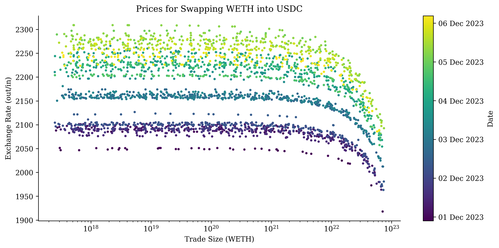
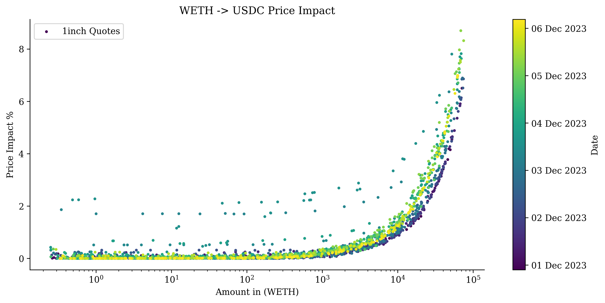

1Inch Quotes: Modeling DEX Slippage
===================================

[](https://github.com/psf/black)
[](http://mypy-lang.org/)
[](https://github.com/xenophonlabs/oneinch-quotes/actions/workflows/CI.yml/badge.svg)


*This repo is being used as part of the [crvUSD Risk Modeling effort](https://github.com/xenophonlabs/crvUSDrisk).*

## About

As part of the [crvUSD Risk Modeling effort](https://github.com/xenophonlabs/crvUSDrisk), we have been storing quotes from the [1Inch Swap API](https://portal.1inch.dev/documentation/swap/swagger?method=get&path=%2Fv5.2%2F1%2Fquote) for certain tokens pertaining to the crvUSD ecosystem (a full list can be found in `src.configs.tokens.py` and is reproduced below).

We query random trade sizes for each token pair every hour to generate a `price impact curve`. This allows us to model the expected price impact of traders arbitraging the various pools connected to Curve's new stablecoin. In turn, this gives us a reasonable idea of when price-sensitive arbitrageur would or would not arbitrage mispricings in these pools. A more detailed explanation of how these price impact curves are used can be found here: `https://github.com/xenophonlabs/crvUSDrisk/blob/main/notebooks/demo_slippage_curves.ipynb`.


*Sample quotes for WETH -> USDC between December 1, 2023 and December 8, 2023.*


*Sample price impact curve for WETH -> USDC between December 1, 2023 and December 8, 2023.*


### Supported Tokens

All pairwise combinations of the below tokens have been stored every hour since Thursday, November 16, 2023 at 6pm UTC. 

| Image | Name | Parameters |
| -------- | ----------- | ---------- |
| [](https://assets.coingecko.com/coins/images/6319/thumb/usdc.png?1696506694) | USDC | `0xa0b86991c6218b36c1d19d4a2e9eb0ce3606eb48` |
| [](https://assets.coingecko.com/coins/images/325/thumb/Tether.png?1696501661) | USDT | `0xdac17f958d2ee523a2206206994597c13d831ec7` |
| [](https://assets.coingecko.com/coins/images/6013/thumb/Pax_Dollar.png?1696506427) | USDP | `0x8e870d67f660d95d5be530380d0ec0bd388289e1` |
| [](https://assets.coingecko.com/coins/images/3449/thumb/tusd.png?1696504140) | TUSD | `0x0000000000085d4780b73119b644ae5ecd22b376` |
| [](https://assets.coingecko.com/coins/images/2518/thumb/weth.png?1696503332) | WETH | `0xc02aaa39b223fe8d0a0e5c4f27ead9083c756cc2` |
| [](https://assets.coingecko.com/coins/images/18834/thumb/wstETH.png?1696518295) | wstETH | `0x7f39c581f595b53c5cb19bd0b3f8da6c935e2ca0` |
| [](https://assets.coingecko.com/coins/images/28285/thumb/sfrxETH_icon.png?1696527285) | sfrxETH | `0xac3e018457b222d93114458476f3e3416abbe38f` |
| [](https://assets.coingecko.com/coins/images/7598/thumb/wrapped_bitcoin_wbtc.png?1696507857) | WBTC | `0x2260fac5e5542a773aa44fbcfedf7c193bc2c599` |
| [](https://assets.coingecko.com/coins/images/11224/thumb/0x18084fba666a33d37592fa2633fd49a74dd93a88.png?1696511155) | tBTC | `0x18084fba666a33d37592fa2633fd49a74dd93a88` |

## Usage

All API requests should be made to the base URL: `http://97.107.138.106/` with the endpoint `quotes`. 

Below, we query quotes for all pairs of the supported tokens from December 12, 2023 to December 13, 2023. Notice that the `start` and `end` parameters are **REQUIRED** and that we use the `--compressed` flag to speed up the query.

```bash
curl --compressed "http://97.107.138.106/quotes?&start=1702166400&end=1702252800"
```

Please refer to `notebooks/demo_slippage_curves.ipynb` for a more detailed example.

*Note that Python's `requests` will handle the `gzip` compression automatically.*

### Parameters

| Parameter           | Description                                                                                          | Default Value  | Required |
|---------------------|------------------------------------------------------------------------------------------------------|----------------|----------|
| start               | The start timestamp to get quotes for.        | None           | Yes      |
| end                 | The end timestamp to get quotes for.        | None           | Yes      |
| tokens                | Comma-separated string of token addresses to get quotes for. All pairwise permutations of the provided tokens will be fetched. If not provided, all token pairs are returned.                                | None           | No       |
| cols                | Comma-separated string of columns to return. If not provided, the following are returned: [`src`, `dst`, `in_amount`, `out_amount`, `price`, `price_impact`, `timestamp`].                                    | None           | No       |
| process             | Whether to process the quotes. If processed, the returned quotes will be grouped by `hour` and a `price_impact` column will be added. Refer to `src.db.datahandler.DataHandler.process_quotes`. | True           | No       |
| include-ref-price   | Whether to include the inferred reference price for the price impact calc.                           | False          | No       |

##### Further explanation on `tokens` parameter

Quotes for all pairwise permutations of the given `tokens` will be fetched (as long as they are supported). 

For example: `tokens=USDC,USDT,WETH` will return quotes for:

- WETH -> USDC
- USDC -> WETH
- USDT -> USDC
- USDC -> USDT
- USDT -> WETH
- WETH -> USDT

*Please note the parameter should specify token **addresses** not symbols.*

### To Do

There are a couple things we are still working on here:

- Cache common responses.

- Acquire and configure a domain name.

- Add more tokens to our queries. 
